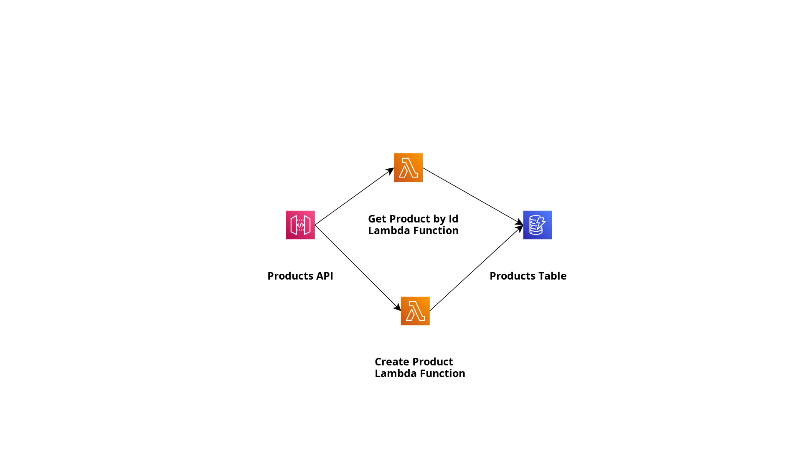

# Explore ways to run Spring Boot application with AWS Lambda Java or Customer Runtime with GraalVM Native Image  

## Architecture

<p align="center">
  
</p>

## Project Description
The code example include storing and retrieving product from the Amazon DynamoDB. I put Amazon API Gateway in front of my Lambdas.

I explore the following ways to run Spring Boot application with AWS Lambda Java or Customer Runtime with GraalVM Native Image:  

- Lambda with Java 21 Runtime and Spring Boot 3.2 and aws-serverless-java-container   
- Lambda with Java 21 Runtime and Spring Boot 3.2 and Spring Cloud Function   
- Lambda with Java 21 Runtime and Spring Boot 3.2 and Lambda Web Adapter   
- Lambda with Custom Runtime and Spring Boot 3.2 and GraalVM Native Image  


I made all the test for the following use cases:  

- Lambda function without SnapStart enabled  
- Lambda function with SnapStart enabled but without usage of Priming  
  -- doesn't currently work for AWS Custom Runtimes, so for GraalVM Native Image    
- Lambda function with SnapStart enabled but with usage of Priming (DynamoDB request invocation and if possible proxing the whole web request)  
  -- doesn't currently work for AWS Custom Runtimes, so for GraalVM Native Image      

# Installation and deployment

```bash

Clone git repository locally
git clone https://github.com/Vadym79/AWSLambdaJavaWithSpringBoot.git

Compile and package the Java application with Maven from the root (where pom.xml is located) of the project
mvn clean package

Deploy your application with AWS SAM
sam deploy -g  
```

In order not to use AWS Lambda SnapStart comment both lines in the globals's section of the Lambda function.

Globals:  
  Function:  
     #SnapStart:  
       #ApplyOn: PublishedVersions   

In order to user AWS Lambda SnapStart uncomment both lines above. For different Priming optimizations enabling of SnapStart is required.  
SnapStart doesn't currently work for AWS Custom Runtimes, so for GraalVM Native Image.  


## Further Readings 

You can read my article series "AWS Lambda SnapStart" on https://dev.to/vkazulkin/measuring-java-11-lambda-cold-starts-with-snapstart-part-1-first-impressions-30a4
